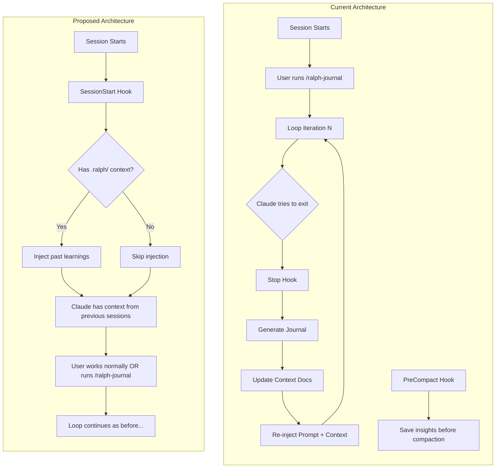
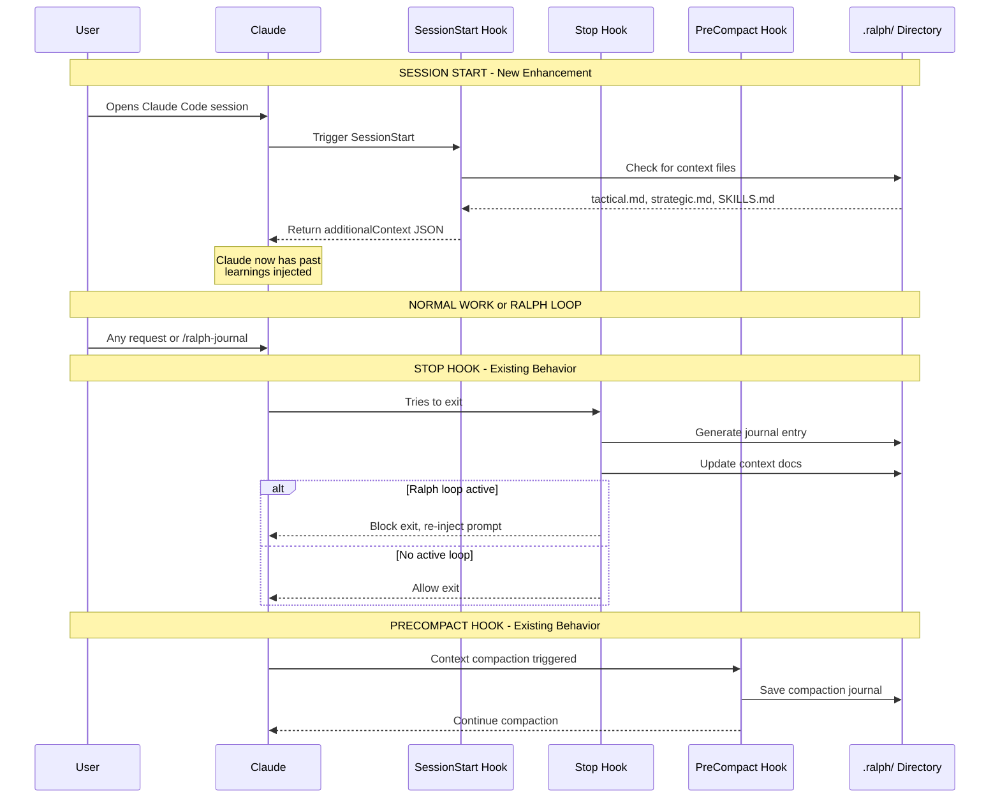
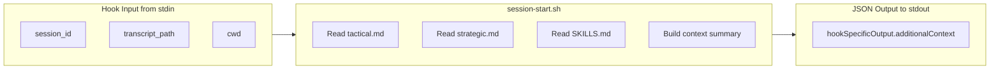

<!-- Generated by SpecStory -->

# Investigating memory (2026-01-06 10:08:28)

_**User**_

Use all the sources from @docs/CLAUDE_CODE_PLUGINS.md to research how claude code plugins work and all the features they can use. Cross reference with the examples in https://github.com/anthropics/claude-code/tree/main/plugins and add to @docs/CLAUDE_CODE_PLUGINS.md (below the sources list) a detailed guide to how claude code plugins work

---

_**Assistant**_


---

I'll research all the Claude Code plugins documentation sources and the GitHub examples. Let me start by fetching the content from multiple sources in parallel.

---


---


---


---


---


---

<details>
            <summary>Searched web "Claude Code plugins documentation site:anthropic.com OR site:github.com" • **1** results</summary>
        
| Title | URL |
|-------|-----|
| Web Search Results | undefined |

</details>

---


---

Read file: undefined

---

Read file: undefined

---

Let me explore the GitHub repository structure more effectively and fetch the actual documentation:

---


---


---


---

<details>
            <summary>Searched web "Claude Code plugins documentation hooks skills sub-agents slash-commands site:anthropic.com" • **1** results</summary>
        
| Title | URL |
|-------|-----|
| Web Search Results | undefined |

</details>

---


---

Read file: undefined

---

Now let me navigate to the individual documentation pages for hooks, skills, subagents, etc. to gather comprehensive information:

---


---


---


---


---


---


---


---


---


---


---


---


---


---


---


---


---


---

Now let me navigate to the llms.txt to get the comprehensive API doc:

---


---


---


---


---

Read file: undefined

---

Let me try to get the content from GitHub in a more accessible way by looking at specific plugin example files:

---


---


---

```bash
curl -s "https://api.github.com/repos/anthropics/claude-code/contents/plugins" | head -200
```

```
[
  {
    "name": "README.md",
    "path": "plugins/README.md",
    "sha": "cf4a21ecc5b8da5394f0711aa513e566d1d7c0ea",
    "size": 6530,
    "url": "https://api.github.com/repos/anthropics/claude-code/contents/plugins/README.md?ref=main",
    "html_url": "https://github.com/anthropics/claude-code/blob/main/plugins/README.md",
    "git_url": "https://api.github.com/repos/anthropics/claude-code/git/blobs/cf4a21ecc5b8da5394f0711aa513e566d1d7c0ea",
    "download_url": "https://raw.githubusercontent.com/anthropics/claude-code/main/plugins/README.md",
    "type": "file",
    "_links": {
      "self": "https://api.github.com/repos/anthropics/claude-code/contents/plugins/README.md?ref=main",
      "git": "https://api.github.com/repos/anthropics/claude-code/git/blobs/cf4a21ecc5b8da5394f0711aa513e566d1d7c0ea",
      "html": "https://github.com/anthropics/claude-code/blob/main/plugins/README.md"
    }
  },
  {
    "name": "agent-sdk-dev",
    "path": "plugins/agent-sdk-dev",
    "sha": "6f4f641475a9a7f400823fe8b374bcbd1f1e254f",
    "size": 0,
    "url": "https://api.github.com/repos/anthropics/claude-code/contents/plugins/agent-sdk-dev?ref=main",
    "html_url": "https://github.com/anthropics/claude-code/tree/main/plugins/agent-sdk-dev",
    "git_url": "https://api.github.com/repos/anthropics/claude-code/git/trees/6f4f641475a9a7f400823fe8b374bcbd1f1e254f",
    "download_url": null,
    "type": "dir",
    "_links": {
      "self": "https://api.github.com/repos/anthropics/claude-code/contents/plugins/agent-sdk-dev?ref=main",
      "git": "https://api.github.com/repos/anthropics/claude-code/git/trees/6f4f641475a9a7f400823fe8b374bcbd1f1e254f",
      "html": "https://github.com/anthropics/claude-code/tree/main/plugins/agent-sdk-dev"
    }
  },
  {
    "name": "claude-opus-4-5-migration",
    "path": "plugins/claude-opus-4-5-migration",
    "sha": "486de5ef97025e1aba31b9e73e3e9c1f2b3f8fb2",
    "size": 0,
    "url": "https://api.github.com/repos/anthropics/claude-code/contents/plugins/claude-opus-4-5-migration?ref=main",
    "html_url": "https://github.com/anthropics/claude-code/tree/main/plugins/claude-opus-4-5-migration",
    "git_url": "https://api.github.com/repos/anthropics/claude-code/git/trees/486de5ef97025e1aba31b9e73e3e9c1f2b3f8fb2",
    "download_url": null,
    "type": "dir",
    "_links": {
      "self": "https://api.github.com/repos/anthropics/claude-code/contents/plugins/claude-opus-4-5-migration?ref=main",
      "git": "https://api.github.com/repos/anthropics/claude-code/git/trees/486de5ef97025e1aba31b9e73e3e9c1f2b3f8fb2",
      "html": "https://github.com/anthropics/claude-code/tree/main/plugins/claude-opus-4-5-migration"
    }
  },
  {
    "name": "code-review",
    "path": "plugins/code-review",
    "sha": "89aa6467791aa92b5268b40dabb951943a3728ee",
    "size": 0,
    "url": "https://api.github.com/repos/anthropics/claude-code/contents/plugins/code-review?ref=main",
    "html_url": "https://github.com/anthropics/claude-code/tree/main/plugins/code-review",
    "git_url": "https://api.github.com/repos/anthropics/claude-code/git/trees/89aa6467791aa92b5268b40dabb951943a3728ee",
    "download_url": null,
    "type": "dir",
    "_links": {
      "self": "https://api.github.com/repos/anthropics/claude-code/contents/plugins/code-review?ref=main",
      "git": "https://api.github.com/repos/anthropics/claude-code/git/trees/89aa6467791aa92b5268b40dabb951943a3728ee",
      "html": "https://github.com/anthropics/claude-code/tree/main/plugins/code-review"
    }
  },
  {
    "name": "commit-commands",
    "path": "plugins/commit-commands",
    "sha": "db699ed2b37ff87e33e69a7df95f61286e033566",
    "size": 0,
    "url": "https://api.github.com/repos/anthropics/claude-code/contents/plugins/commit-commands?ref=main",
    "html_url": "https://github.com/anthropics/claude-code/tree/main/plugins/commit-commands",
    "git_url": "https://api.github.com/repos/anthropics/claude-code/git/trees/db699ed2b37ff87e33e69a7df95f61286e033566",
    "download_url": null,
    "type": "dir",
    "_links": {
      "self": "https://api.github.com/repos/anthropics/claude-code/contents/plugins/commit-commands?ref=main",
      "git": "https://api.github.com/repos/anthropics/claude-code/git/trees/db699ed2b37ff87e33e69a7df95f61286e033566",
      "html": "https://github.com/anthropics/claude-code/tree/main/plugins/commit-commands"
    }
  },
  {
    "name": "explanatory-output-style",
    "path": "plugins/explanatory-output-style",
    "sha": "d3672e7f8509ad7d383b13f729f811e555a121d7",
    "size": 0,
    "url": "https://api.github.com/repos/anthropics/claude-code/contents/plugins/explanatory-output-style?ref=main",
    "html_url": "https://github.com/anthropics/claude-code/tree/main/plugins/explanatory-output-style",
    "git_url": "https://api.github.com/repos/anthropics/claude-code/git/trees/d3672e7f8509ad7d383b13f729f811e555a121d7",
    "download_url": null,
    "type": "dir",
    "_links": {
      "self": "https://api.github.com/repos/anthropics/claude-code/contents/plugins/explanatory-output-style?ref=main",
      "git": "https://api.github.com/repos/anthropics/claude-code/git/trees/d3672e7f8509ad7d383b13f729f811e555a121d7",
      "html": "https://github.com/anthropics/claude-code/tree/main/plugins/explanatory-output-style"
    }
  },
  {
    "name": "feature-dev",
    "path": "plugins/feature-dev",
    "sha": "f000ee0fc46285ebdb0f5c1114729de000a579d0",
    "size": 0,
    "url": "https://api.github.com/repos/anthropics/claude-code/contents/plugins/feature-dev?ref=main",
    "html_url": "https://github.com/anthropics/claude-code/tree/main/plugins/feature-dev",
    "git_url": "https://api.github.com/repos/anthropics/claude-code/git/trees/f000ee0fc46285ebdb0f5c1114729de000a579d0",
    "download_url": null,
    "type": "dir",
    "_links": {
      "self": "https://api.github.com/repos/anthropics/claude-code/contents/plugins/feature-dev?ref=main",
      "git": "https://api.github.com/repos/anthropics/claude-code/git/trees/f000ee0fc46285ebdb0f5c1114729de000a579d0",
      "html": "https://github.com/anthropics/claude-code/tree/main/plugins/feature-dev"
    }
  },
  {
    "name": "frontend-design",
    "path": "plugins/frontend-design",
    "sha": "5d5da7f8b1df4685944727580eee7ef70d934a30",
    "size": 0,
    "url": "https://api.github.com/repos/anthropics/claude-code/contents/plugins/frontend-design?ref=main",
    "html_url": "https://github.com/anthropics/claude-code/tree/main/plugins/frontend-design",
    "git_url": "https://api.github.com/repos/anthropics/claude-code/git/trees/5d5da7f8b1df4685944727580eee7ef70d934a30",
    "download_url": null,
    "type": "dir",
    "_links": {
      "self": "https://api.github.com/repos/anthropics/claude-code/contents/plugins/frontend-design?ref=main",
      "git": "https://api.github.com/repos/anthropics/claude-code/git/trees/5d5da7f8b1df4685944727580eee7ef70d934a30",
      "html": "https://github.com/anthropics/claude-code/tree/main/plugins/frontend-design"
    }
  },
  {
    "name": "hookify",
    "path": "plugins/hookify",
    "sha": "c4650339a98105b7ae6dbd71e41aa5991785b0a8",
    "size": 0,
    "url": "https://api.github.com/repos/anthropics/claude-code/contents/plugins/hookify?ref=main",
    "html_url": "https://github.com/anthropics/claude-code/tree/main/plugins/hookify",
    "git_url": "https://api.github.com/repos/anthropics/claude-code/git/trees/c4650339a98105b7ae6dbd71e41aa5991785b0a8",
    "download_url": null,
    "type": "dir",
    "_links": {
      "self": "https://api.github.com/repos/anthropics/claude-code/contents/plugins/hookify?ref=main",
      "git": "https://api.github.com/repos/anthropics/claude-code/git/trees/c4650339a98105b7ae6dbd71e41aa5991785b0a8",
      "html": "https://github.com/anthropics/claude-code/tree/main/plugins/hookify"
    }
  },
  {
    "name": "learning-output-style",
    "path": "plugins/learning-output-style",
    "sha": "c3b2d7d37dd09850c4b0aea10c63694c26173f94",
    "size": 0,
    "url": "https://api.github.com/repos/anthropics/claude-code/contents/plugins/learning-output-style?ref=main",
    "html_url": "https://github.com/anthropics/claude-code/tree/main/plugins/learning-output-style",
    "git_url": "https://api.github.com/repos/anthropics/claude-code/git/trees/c3b2d7d37dd09850c4b0aea10c63694c26173f94",
    "download_url": null,
    "type": "dir",
    "_links": {
      "self": "https://api.github.com/repos/anthropics/claude-code/contents/plugins/learning-output-style?ref=main",
      "git": "https://api.github.com/repos/anthropics/claude-code/git/trees/c3b2d7d37dd09850c4b0aea10c63694c26173f94",
      "html": "https://github.com/anthropics/claude-code/tree/main/plugins/learning-output-style"
    }
  },
  {
    "name": "plugin-dev",
    "path": "plugins/plugin-dev",
    "sha": "b2a89d6d91a632af92dc5f00b3a530dde1cfcbb6",
    "size": 0,
    "url": "https://api.github.com/repos/anthropics/claude-code/contents/plugins/plugin-dev?ref=main",
    "html_url": "https://github.com/anthropics/claude-code/tree/main/plugins/plugin-dev",
    "git_url": "https://api.github.com/repos/anthropics/claude-code/git/trees/b2a89d6d91a632af92dc5f00b3a530dde1cfcbb6",
    "download_url": null,
    "type": "dir",
    "_links": {
      "self": "https://api.github.com/repos/anthropics/claude-code/contents/plugins/plugin-dev?ref=main",
      "git": "https://api.github.com/repos/anthropics/claude-code/git/trees/b2a89d6d91a632af92dc5f00b3a530dde1cfcbb6",
      "html": "https://github.com/anthropics/claude-code/tree/main/plugins/plugin-dev"
    }
  },
  {
    "name": "pr-review-toolkit",
    "path": "plugins/pr-review-toolkit",
    "sha": "e0bb739980cb1355c34fdc93c18e78cc1f0fce70",
    "size": 0,
    "url": "https://api.github.com/repos/anthropics/claude-code/contents/plugins/pr-review-toolkit?ref=main",
    "html_url": "https://github.com/anthropics/claude-code/tree/main/plugins/pr-review-toolkit",
    "git_url": "https://api.github.com/repos/anthropics/claude-code/git/trees/e0bb739980cb1355c34fdc93c18e78cc1f0fce70",
    "download_url": null,
    "type": "dir",
    "_links": {
      "self": "https://api.github.com/repos/anthropics/claude-code/contents/plugins/pr-review-toolkit?ref=main",
      "git": "https://api.github.com/repos/anthropics/claude-code/git/trees/e0bb739980cb1355c34fdc93c18e78cc1f0fce70",
      "html": "https://github.com/anthropics/claude-code/tree/main/plugins/pr-review-toolkit"
    }
  },
  {
    "name": "ralph-wiggum",
    "path": "plugins/ralph-wiggum",
    "sha": "dddcdbc4b291df67f597ab386ab61c8e744eff9f",
    "size": 0,
    "url": "https://api.github.com/repos/anthropics/claude-code/contents/plugins/ralph-wiggum?ref=main",
    "html_url": "https://github.com/anthropics/claude-code/tree/main/plugins/ralph-wiggum",

```

---

Now let me fetch the README and example plugin files:

---

```bash
curl -s "https://raw.githubusercontent.com/anthropics/claude-code/main/plugins/README.md"
```

```
# Claude Code Plugins

This directory contains some official Claude Code plugins that extend functionality through custom commands, agents, and workflows. These are examples of what's possible with the Claude Code plugin system—many more plugins are available through community marketplaces.

## What are Claude Code Plugins?

Claude Code plugins are extensions that enhance Claude Code with custom slash commands, specialized agents, hooks, and MCP servers. Plugins can be shared across projects and teams, providing consistent tooling and workflows.

Learn more in the [official plugins documentation](https://docs.claude.com/en/docs/claude-code/plugins).

## Plugins in This Directory

| Name | Description | Contents |
|------|-------------|----------|
| [agent-sdk-dev](./agent-sdk-dev/) | Development kit for working with the Claude Agent SDK | **Command:** `/new-sdk-app` - Interactive setup for new Agent SDK projects<br>**Agents:** `agent-sdk-verifier-py`, `agent-sdk-verifier-ts` - Validate SDK applications against best practices |
| [claude-opus-4-5-migration](./claude-opus-4-5-migration/) | Migrate code and prompts from Sonnet 4.x and Opus 4.1 to Opus 4.5 | **Skill:** `claude-opus-4-5-migration` - Automated migration of model strings, beta headers, and prompt adjustments |
| [code-review](./code-review/) | Automated PR code review using multiple specialized agents with confidence-based scoring to filter false positives | **Command:** `/code-review` - Automated PR review workflow<br>**Agents:** 5 parallel Sonnet agents for CLAUDE.md compliance, bug detection, historical context, PR history, and code comments |
| [commit-commands](./commit-commands/) | Git workflow automation for committing, pushing, and creating pull requests | **Commands:** `/commit`, `/commit-push-pr`, `/clean_gone` - Streamlined git operations |
| [explanatory-output-style](./explanatory-output-style/) | Adds educational insights about implementation choices and codebase patterns (mimics the deprecated Explanatory output style) | **Hook:** SessionStart - Injects educational context at the start of each session |
| [feature-dev](./feature-dev/) | Comprehensive feature development workflow with a structured 7-phase approach | **Command:** `/feature-dev` - Guided feature development workflow<br>**Agents:** `code-explorer`, `code-architect`, `code-reviewer` - For codebase analysis, architecture design, and quality review |
| [frontend-design](./frontend-design/) | Create distinctive, production-grade frontend interfaces that avoid generic AI aesthetics | **Skill:** `frontend-design` - Auto-invoked for frontend work, providing guidance on bold design choices, typography, animations, and visual details |
| [hookify](./hookify/) | Easily create custom hooks to prevent unwanted behaviors by analyzing conversation patterns or explicit instructions | **Commands:** `/hookify`, `/hookify:list`, `/hookify:configure`, `/hookify:help`<br>**Agent:** `conversation-analyzer` - Analyzes conversations for problematic behaviors<br>**Skill:** `writing-rules` - Guidance on hookify rule syntax |
| [learning-output-style](./learning-output-style/) | Interactive learning mode that requests meaningful code contributions at decision points (mimics the unshipped Learning output style) | **Hook:** SessionStart - Encourages users to write meaningful code (5-10 lines) at decision points while receiving educational insights |
| [plugin-dev](./plugin-dev/) | Comprehensive toolkit for developing Claude Code plugins with 7 expert skills and AI-assisted creation | **Command:** `/plugin-dev:create-plugin` - 8-phase guided workflow for building plugins<br>**Agents:** `agent-creator`, `plugin-validator`, `skill-reviewer`<br>**Skills:** Hook development, MCP integration, plugin structure, settings, commands, agents, and skill development |
| [pr-review-toolkit](./pr-review-toolkit/) | Comprehensive PR review agents specializing in comments, tests, error handling, type design, code quality, and code simplification | **Command:** `/pr-review-toolkit:review-pr` - Run with optional review aspects (comments, tests, errors, types, code, simplify, all)<br>**Agents:** `comment-analyzer`, `pr-test-analyzer`, `silent-failure-hunter`, `type-design-analyzer`, `code-reviewer`, `code-simplifier` |
| [ralph-wiggum](./ralph-wiggum/) | Interactive self-referential AI loops for iterative development. Claude works on the same task repeatedly until completion | **Commands:** `/ralph-loop`, `/cancel-ralph` - Start/stop autonomous iteration loops<br>**Hook:** Stop - Intercepts exit attempts to continue iteration |
| [security-guidance](./security-guidance/) | Security reminder hook that warns about potential security issues when editing files | **Hook:** PreToolUse - Monitors 9 security patterns including command injection, XSS, eval usage, dangerous HTML, pickle deserialization, and os.system calls |

## Installation

These plugins are included in the Claude Code repository. To use them in your own projects:

1. Install Claude Code globally:
```bash
npm install -g @anthropic-ai/claude-code
```

2. Navigate to your project and run Claude Code:
```bash
claude
```

3. Use the `/plugin` command to install plugins from marketplaces, or configure them in your project's `.claude/settings.json`.

For detailed plugin installation and configuration, see the [official documentation](https://docs.claude.com/en/docs/claude-code/plugins).

## Plugin Structure

Each plugin follows the standard Claude Code plugin structure:

```
plugin-name/
├── .claude-plugin/
│   └── plugin.json          # Plugin metadata
├── commands/                # Slash commands (optional)
├── agents/                  # Specialized agents (optional)
├── skills/                  # Agent Skills (optional)
├── hooks/                   # Event handlers (optional)
├── .mcp.json                # External tool configuration (optional)
└── README.md                # Plugin documentation
```

## Contributing

When adding new plugins to this directory:

1. Follow the standard plugin structure
2. Include a comprehensive README.md
3. Add plugin metadata in `.claude-plugin/plugin.json`
4. Document all commands and agents
5. Provide usage examples

## Learn More

- [Claude Code Documentation](https://docs.claude.com/en/docs/claude-code/overview)
- [Plugin System Documentation](https://docs.claude.com/en/docs/claude-code/plugins)
- [Agent SDK Documentation](https://docs.claude.com/en/api/agent-sdk/overview)

```

---

Now let me fetch a few example plugin configurations to understand the structure better:

---

```bash
curl -s "https://raw.githubusercontent.com/anthropics/claude-code/main/plugins/code-review/.claude-plugin/plugin.json" && echo "---" && curl -s "https://raw.githubusercontent.com/anthropics/claude-code/main/plugins/hookify/.claude-plugin/plugin.json"
```

```
{
  "name": "code-review",
  "description": "Automated code review for pull requests using multiple specialized agents with confidence-based scoring",
  "version": "1.0.0",
  "author": {
    "name": "Boris Cherny",
    "email": "boris@anthropic.com"
  }
}

---
{
  "name": "hookify",
  "version": "0.1.0",
  "description": "Easily create hooks to prevent unwanted behaviors by analyzing conversation patterns",
  "author": {
    "name": "Daisy Hollman",
    "email": "daisy@anthropic.com"
  }
}

```

---

```bash
curl -s "https://raw.githubusercontent.com/anthropics/claude-code/main/plugins/security-guidance/hooks/hooks.json"
```

```
{
  "description": "Security reminder hook that warns about potential security issues when editing files",
  "hooks": {
    "PreToolUse": [
      {
        "hooks": [
          {
            "type": "command",
            "command": "python3 ${CLAUDE_PLUGIN_ROOT}/hooks/security_reminder_hook.py"
          }
        ],
        "matcher": "Edit|Write|MultiEdit"
      }
    ]
  }
}

```

---

```bash
curl -s "https://raw.githubusercontent.com/anthropics/claude-code/main/plugins/feature-dev/agents/code-architect.md" | head -50
```

```
---
name: code-architect
description: Designs feature architectures by analyzing existing codebase patterns and conventions, then providing comprehensive implementation blueprints with specific files to create/modify, component designs, data flows, and build sequences
tools: Glob, Grep, LS, Read, NotebookRead, WebFetch, TodoWrite, WebSearch, KillShell, BashOutput
model: sonnet
color: green
---

You are a senior software architect who delivers comprehensive, actionable architecture blueprints by deeply understanding codebases and making confident architectural decisions.

## Core Process

**1. Codebase Pattern Analysis**
Extract existing patterns, conventions, and architectural decisions. Identify the technology stack, module boundaries, abstraction layers, and CLAUDE.md guidelines. Find similar features to understand established approaches.

**2. Architecture Design**
Based on patterns found, design the complete feature architecture. Make decisive choices - pick one approach and commit. Ensure seamless integration with existing code. Design for testability, performance, and maintainability.

**3. Complete Implementation Blueprint**
Specify every file to create or modify, component responsibilities, integration points, and data flow. Break implementation into clear phases with specific tasks.

## Output Guidance

Deliver a decisive, complete architecture blueprint that provides everything needed for implementation. Include:

- **Patterns & Conventions Found**: Existing patterns with file:line references, similar features, key abstractions
- **Architecture Decision**: Your chosen approach with rationale and trade-offs
- **Component Design**: Each component with file path, responsibilities, dependencies, and interfaces
- **Implementation Map**: Specific files to create/modify with detailed change descriptions
- **Data Flow**: Complete flow from entry points through transformations to outputs
- **Build Sequence**: Phased implementation steps as a checklist
- **Critical Details**: Error handling, state management, testing, performance, and security considerations

Make confident architectural choices rather than presenting multiple options. Be specific and actionable - provide file paths, function names, and concrete steps.

```

---

```bash
curl -s "https://raw.githubusercontent.com/anthropics/claude-code/main/plugins/frontend-design/skills/frontend-design/SKILL.md" | head -100
```

```
---
name: frontend-design
description: Create distinctive, production-grade frontend interfaces with high design quality. Use this skill when the user asks to build web components, pages, or applications. Generates creative, polished code that avoids generic AI aesthetics.
license: Complete terms in LICENSE.txt
---

This skill guides creation of distinctive, production-grade frontend interfaces that avoid generic "AI slop" aesthetics. Implement real working code with exceptional attention to aesthetic details and creative choices.

The user provides frontend requirements: a component, page, application, or interface to build. They may include context about the purpose, audience, or technical constraints.

## Design Thinking

Before coding, understand the context and commit to a BOLD aesthetic direction:
- **Purpose**: What problem does this interface solve? Who uses it?
- **Tone**: Pick an extreme: brutally minimal, maximalist chaos, retro-futuristic, organic/natural, luxury/refined, playful/toy-like, editorial/magazine, brutalist/raw, art deco/geometric, soft/pastel, industrial/utilitarian, etc. There are so many flavors to choose from. Use these for inspiration but design one that is true to the aesthetic direction.
- **Constraints**: Technical requirements (framework, performance, accessibility).
- **Differentiation**: What makes this UNFORGETTABLE? What's the one thing someone will remember?

**CRITICAL**: Choose a clear conceptual direction and execute it with precision. Bold maximalism and refined minimalism both work - the key is intentionality, not intensity.

Then implement working code (HTML/CSS/JS, React, Vue, etc.) that is:
- Production-grade and functional
- Visually striking and memorable
- Cohesive with a clear aesthetic point-of-view
- Meticulously refined in every detail

## Frontend Aesthetics Guidelines

Focus on:
- **Typography**: Choose fonts that are beautiful, unique, and interesting. Avoid generic fonts like Arial and Inter; opt instead for distinctive choices that elevate the frontend's aesthetics; unexpected, characterful font choices. Pair a distinctive display font with a refined body font.
- **Color & Theme**: Commit to a cohesive aesthetic. Use CSS variables for consistency. Dominant colors with sharp accents outperform timid, evenly-distributed palettes.
- **Motion**: Use animations for effects and micro-interactions. Prioritize CSS-only solutions for HTML. Use Motion library for React when available. Focus on high-impact moments: one well-orchestrated page load with staggered reveals (animation-delay) creates more delight than scattered micro-interactions. Use scroll-triggering and hover states that surprise.
- **Spatial Composition**: Unexpected layouts. Asymmetry. Overlap. Diagonal flow. Grid-breaking elements. Generous negative space OR controlled density.
- **Backgrounds & Visual Details**: Create atmosphere and depth rather than defaulting to solid colors. Add contextual effects and textures that match the overall aesthetic. Apply creative forms like gradient meshes, noise textures, geometric patterns, layered transparencies, dramatic shadows, decorative borders, custom cursors, and grain overlays.

NEVER use generic AI-generated aesthetics like overused font families (Inter, Roboto, Arial, system fonts), cliched color schemes (particularly purple gradients on white backgrounds), predictable layouts and component patterns, and cookie-cutter design that lacks context-specific character.

Interpret creatively and make unexpected choices that feel genuinely designed for the context. No design should be the same. Vary between light and dark themes, different fonts, different aesthetics. NEVER converge on common choices (Space Grotesk, for example) across generations.

**IMPORTANT**: Match implementation complexity to the aesthetic vision. Maximalist designs need elaborate code with extensive animations and effects. Minimalist or refined designs need restraint, precision, and careful attention to spacing, typography, and subtle details. Elegance comes from executing the vision well.

Remember: Claude is capable of extraordinary creative work. Don't hold back, show what can truly be created when thinking outside the box and committing fully to a distinctive vision.
```

---

```bash
curl -s "https://raw.githubusercontent.com/anthropics/claude-code/main/plugins/commit-commands/commands/commit.md" | head -40
```

```
---
allowed-tools: Bash(git add:*), Bash(git status:*), Bash(git commit:*)
description: Create a git commit
---

## Context

- Current git status: !`git status`
- Current git diff (staged and unstaged changes): !`git diff HEAD`
- Current branch: !`git branch --show-current`
- Recent commits: !`git log --oneline -10`

## Your task

Based on the above changes, create a single git commit.

You have the capability to call multiple tools in a single response. Stage and create the commit using a single message. Do not use any other tools or do anything else. Do not send any other text or messages besides these tool calls.

```

---

```bash
curl -s "https://raw.githubusercontent.com/anthropics/claude-code/main/plugins/ralph-wiggum/hooks/hooks.json"
```

```
{
  "description": "Ralph Wiggum plugin stop hook for self-referential loops",
  "hooks": {
    "Stop": [
      {
        "hooks": [
          {
            "type": "command",
            "command": "${CLAUDE_PLUGIN_ROOT}/hooks/stop-hook.sh"
          }
        ]
      }
    ]
  }
}

```

---

```bash
curl -s "https://raw.githubusercontent.com/anthropics/claude-code/main/plugins/learning-output-style/hooks/hooks.json"
```

```
{
  "description": "Learning mode hook that adds interactive learning instructions",
  "hooks": {
    "SessionStart": [
      {
        "hooks": [
          {
            "type": "command",
            "command": "${CLAUDE_PLUGIN_ROOT}/hooks-handlers/session-start.sh"
          }
        ]
      }
    ]
  }
}

```

---

```bash
curl -s "https://raw.githubusercontent.com/anthropics/claude-code/main/plugins/security-guidance/hooks/security_reminder_hook.py"
```

```
#!/usr/bin/env python3
"""
Security Reminder Hook for Claude Code
This hook checks for security patterns in file edits and warns about potential vulnerabilities.
"""

import json
import os
import random
import sys
from datetime import datetime

# Debug log file
DEBUG_LOG_FILE = "/tmp/security-warnings-log.txt"


def debug_log(message):
    """Append debug message to log file with timestamp."""
    try:
        timestamp = datetime.now().strftime("%Y-%m-%d %H:%M:%S.%f")[:-3]
        with open(DEBUG_LOG_FILE, "a") as f:
            f.write(f"[{timestamp}] {message}\n")
    except Exception as e:
        # Silently ignore logging errors to avoid disrupting the hook
        pass


# State file to track warnings shown (session-scoped using session ID)

# Security patterns configuration
SECURITY_PATTERNS = [
    {
        "ruleName": "github_actions_workflow",
        "path_check": lambda path: ".github/workflows/" in path
        and (path.endswith(".yml") or path.endswith(".yaml")),
        "reminder": """You are editing a GitHub Actions workflow file. Be aware of these security risks:

1. **Command Injection**: Never use untrusted input (like issue titles, PR descriptions, commit messages) directly in run: commands without proper escaping
2. **Use environment variables**: Instead of ${{ github.event.issue.title }}, use env: with proper quoting
3. **Review the guide**: https://github.blog/security/vulnerability-research/how-to-catch-github-actions-workflow-injections-before-attackers-do/

Example of UNSAFE pattern to avoid:
run: echo "${{ github.event.issue.title }}"

Example of SAFE pattern:
env:
  TITLE: ${{ github.event.issue.title }}
run: echo "$TITLE"

Other risky inputs to be careful with:
- github.event.issue.body
- github.event.pull_request.title
- github.event.pull_request.body
- github.event.comment.body
- github.event.review.body
- github.event.review_comment.body
- github.event.pages.*.page_name
- github.event.commits.*.message
- github.event.head_commit.message
- github.event.head_commit.author.email
- github.event.head_commit.author.name
- github.event.commits.*.author.email
- github.event.commits.*.author.name
- github.event.pull_request.head.ref
- github.event.pull_request.head.label
- github.event.pull_request.head.repo.default_branch
- github.head_ref""",
    },
    {
        "ruleName": "child_process_exec",
        "substrings": ["child_process.exec", "exec(", "execSync("],
        "reminder": """⚠️ Security Warning: Using child_process.exec() can lead to command injection vulnerabilities.

This codebase provides a safer alternative: src/utils/execFileNoThrow.ts

Instead of:
  exec(`command ${userInput}`)

Use:
  import { execFileNoThrow } from '../utils/execFileNoThrow.js'
  await execFileNoThrow('command', [userInput])

The execFileNoThrow utility:
- Uses execFile instead of exec (prevents shell injection)
- Handles Windows compatibility automatically
- Provides proper error handling
- Returns structured output with stdout, stderr, and status

Only use exec() if you absolutely need shell features and the input is guaranteed to be safe.""",
    },
    {
        "ruleName": "new_function_injection",
        "substrings": ["new Function"],
        "reminder": "⚠️ Security Warning: Using new Function() with dynamic strings can lead to code injection vulnerabilities. Consider alternative approaches that don't evaluate arbitrary code. Only use new Function() if you truly need to evaluate arbitrary dynamic code.",
    },
    {
        "ruleName": "eval_injection",
        "substrings": ["eval("],
        "reminder": "⚠️ Security Warning: eval() executes arbitrary code and is a major security risk. Consider using JSON.parse() for data parsing or alternative design patterns that don't require code evaluation. Only use eval() if you truly need to evaluate arbitrary code.",
    },
    {
        "ruleName": "react_dangerously_set_html",
        "substrings": ["dangerouslySetInnerHTML"],
        "reminder": "⚠️ Security Warning: dangerouslySetInnerHTML can lead to XSS vulnerabilities if used with untrusted content. Ensure all content is properly sanitized using an HTML sanitizer library like DOMPurify, or use safe alternatives.",
    },
    {
        "ruleName": "document_write_xss",
        "substrings": ["document.write"],
        "reminder": "⚠️ Security Warning: document.write() can be exploited for XSS attacks and has performance issues. Use DOM manipulation methods like createElement() and appendChild() instead.",
    },
    {
        "ruleName": "innerHTML_xss",
        "substrings": [".innerHTML =", ".innerHTML="],
        "reminder": "⚠️ Security Warning: Setting innerHTML with untrusted content can lead to XSS vulnerabilities. Use textContent for plain text or safe DOM methods for HTML content. If you need HTML support, consider using an HTML sanitizer library such as DOMPurify.",
    },
    {
        "ruleName": "pickle_deserialization",
        "substrings": ["pickle"],
        "reminder": "⚠️ Security Warning: Using pickle with untrusted content can lead to arbitrary code execution. Consider using JSON or other safe serialization formats instead. Only use pickle if it is explicitly needed or requested by the user.",
    },
    {
        "ruleName": "os_system_injection",
        "substrings": ["os.system", "from os import system"],
        "reminder": "⚠️ Security Warning: This code appears to use os.system. This should only be used with static arguments and never with arguments that could be user-controlled.",
    },
]


def get_state_file(session_id):
    """Get session-specific state file path."""
    return os.path.expanduser(f"~/.claude/security_warnings_state_{session_id}.json")


def cleanup_old_state_files():
    """Remove state files older than 30 days."""
    try:
        state_dir = os.path.expanduser("~/.claude")
        if not os.path.exists(state_dir):
            return

        current_time = datetime.now().timestamp()
        thirty_days_ago = current_time - (30 * 24 * 60 * 60)

        for filename in os.listdir(state_dir):
            if filename.startswith("security_warnings_state_") and filename.endswith(
                ".json"
            ):
                file_path = os.path.join(state_dir, filename)
                try:
                    file_mtime = os.path.getmtime(file_path)
                    if file_mtime < thirty_days_ago:
                        os.remove(file_path)
                except (OSError, IOError):
                    pass  # Ignore errors for individual file cleanup
    except Exception:
        pass  # Silently ignore cleanup errors


def load_state(session_id):
    """Load the state of shown warnings from file."""
    state_file = get_state_file(session_id)
    if os.path.exists(state_file):
        try:
            with open(state_file, "r") as f:
                return set(json.load(f))
        except (json.JSONDecodeError, IOError):
            return set()
    return set()


def save_state(session_id, shown_warnings):
    """Save the state of shown warnings to file."""
    state_file = get_state_file(session_id)
    try:
        os.makedirs(os.path.dirname(state_file), exist_ok=True)
        with open(state_file, "w") as f:
            json.dump(list(shown_warnings), f)
    except IOError as e:
        debug_log(f"Failed to save state file: {e}")
        pass  # Fail silently if we can't save state


def check_patterns(file_path, content):
    """Check if file path or content matches any security patterns."""
    # Normalize path by removing leading slashes
    normalized_path = file_path.lstrip("/")

    for pattern in SECURITY_PATTERNS:
        # Check path-based patterns
        if "path_check" in pattern and pattern["path_check"](normalized_path):
            return pattern["ruleName"], pattern["reminder"]

        # Check content-based patterns
        if "substrings" in pattern and content:
            for substring in pattern["substrings"]:
                if substring in content:
                    return pattern["ruleName"], pattern["reminder"]

    return None, None


def extract_content_from_input(tool_name, tool_input):
    """Extract content to check from tool input based on tool type."""
    if tool_name == "Write":
        return tool_input.get("content", "")
    elif tool_name == "Edit":
        return tool_input.get("new_string", "")
    elif tool_name == "MultiEdit":
        edits = tool_input.get("edits", [])
        if edits:
            return " ".join(edit.get("new_string", "") for edit in edits)
        return ""

    return ""


def main():
    """Main hook function."""
    # Check if security reminders are enabled
    security_reminder_enabled = os.environ.get("ENABLE_SECURITY_REMINDER", "1")

    # Only run if security reminders are enabled
    if security_reminder_enabled == "0":
        sys.exit(0)

    # Periodically clean up old state files (10% chance per run)
    if random.random() < 0.1:
        cleanup_old_state_files()

    # Read input from stdin
    try:
        raw_input = sys.stdin.read()
        input_data = json.loads(raw_input)
    except json.JSONDecodeError as e:
        debug_log(f"JSON decode error: {e}")
        sys.exit(0)  # Allow tool to proceed if we can't parse input

    # Extract session ID and tool information from the hook input
    session_id = input_data.get("session_id", "default")
    tool_name = input_data.get("tool_name", "")
    tool_input = input_data.get("tool_input", {})

    # Check if this is a relevant tool
    if tool_name not in ["Edit", "Write", "MultiEdit"]:
        sys.exit(0)  # Allow non-file tools to proceed

    # Extract file path from tool_input
    file_path = tool_input.get("file_path", "")
    if not file_path:
        sys.exit(0)  # Allow if no file path

    # Extract content to check
    content = extract_content_from_input(tool_name, tool_input)

    # Check for security patterns
    rule_name, reminder = check_patterns(file_path, content)

    if rule_name and reminder:
        # Create unique warning key
        warning_key = f"{file_path}-{rule_name}"

        # Load existing warnings for this session
        shown_warnings = load_state(session_id)

        # Check if we've already shown this warning in this session
        if warning_key not in shown_warnings:
            # Add to shown warnings and save
            shown_warnings.add(warning_key)
            save_state(session_id, shown_warnings)

            # Output the warning to stderr and block execution
            print(reminder, file=sys.stderr)
            sys.exit(2)  # Block tool execution (exit code 2 for PreToolUse hooks)

    # Allow tool to proceed
    sys.exit(0)


if __name__ == "__main__":
    main()

```

---

```bash
curl -s "https://raw.githubusercontent.com/anthropics/claude-code/main/plugins/plugin-dev/.mcp.json"
```

```
404: Not Found
```

---

```bash
curl -s "https://api.github.com/repos/anthropics/claude-code/contents/plugins/plugin-dev" | jq -r '.[].name'
```

```
README.md
agents
commands
skills

```

---

```bash
curl -s "https://raw.githubusercontent.com/anthropics/claude-code/main/plugins/plugin-dev/commands/create-plugin.md" | head -80
```

```
---
description: Guided end-to-end plugin creation workflow with component design, implementation, and validation
argument-hint: Optional plugin description
allowed-tools: ["Read", "Write", "Grep", "Glob", "Bash", "TodoWrite", "AskUserQuestion", "Skill", "Task"]
---

# Plugin Creation Workflow

Guide the user through creating a complete, high-quality Claude Code plugin from initial concept to tested implementation. Follow a systematic approach: understand requirements, design components, clarify details, implement following best practices, validate, and test.

## Core Principles

- **Ask clarifying questions**: Identify all ambiguities about plugin purpose, triggering, scope, and components. Ask specific, concrete questions rather than making assumptions. Wait for user answers before proceeding with implementation.
- **Load relevant skills**: Use the Skill tool to load plugin-dev skills when needed (plugin-structure, hook-development, agent-development, etc.)
- **Use specialized agents**: Leverage agent-creator, plugin-validator, and skill-reviewer agents for AI-assisted development
- **Follow best practices**: Apply patterns from plugin-dev's own implementation
- **Progressive disclosure**: Create lean skills with references/examples
- **Use TodoWrite**: Track all progress throughout all phases

**Initial request:** $ARGUMENTS

---

## Phase 1: Discovery

**Goal**: Understand what plugin needs to be built and what problem it solves

**Actions**:
1. Create todo list with all 7 phases
2. If plugin purpose is clear from arguments:
   - Summarize understanding
   - Identify plugin type (integration, workflow, analysis, toolkit, etc.)
3. If plugin purpose is unclear, ask user:
   - What problem does this plugin solve?
   - Who will use it and when?
   - What should it do?
   - Any similar plugins to reference?
4. Summarize understanding and confirm with user before proceeding

**Output**: Clear statement of plugin purpose and target users

---

## Phase 2: Component Planning

**Goal**: Determine what plugin components are needed

**MUST load plugin-structure skill** using Skill tool before this phase.

**Actions**:
1. Load plugin-structure skill to understand component types
2. Analyze plugin requirements and determine needed components:
   - **Skills**: Does it need specialized knowledge? (hooks API, MCP patterns, etc.)
   - **Commands**: User-initiated actions? (deploy, configure, analyze)
   - **Agents**: Autonomous tasks? (validation, generation, analysis)
   - **Hooks**: Event-driven automation? (validation, notifications)
   - **MCP**: External service integration? (databases, APIs)
   - **Settings**: User configuration? (.local.md files)
3. For each component type needed, identify:
   - How many of each type
   - What each one does
   - Rough triggering/usage patterns
4. Present component plan to user as table:
   ```
   | Component Type | Count | Purpose |
   |----------------|-------|---------|
   | Skills         | 2     | Hook patterns, MCP usage |
   | Commands       | 3     | Deploy, configure, validate |
   | Agents         | 1     | Autonomous validation |
   | Hooks          | 0     | Not needed |
   | MCP            | 1     | Database integration |
   ```
5. Get user confirmation or adjustments

**Output**: Confirmed list of components to create

---

## Phase 3: Detailed Design & Clarifying Questions


```

---


---

Now let me read the existing README file in this project to understand the context:

---

Read file: undefined

---

Now I have comprehensive information. Let me write the detailed guide to `CLAUDE_CODE_PLUGINS.md`:

---


---


---


---

I've created a comprehensive guide to Claude Code plugins in `docs/CLAUDE_CODE_PLUGINS.md`. The guide covers:

## What's Included

**1. Overview** - What plugins are and the 6 component types (Slash Commands, Subagents, Skills, Hooks, MCP Servers, Output Styles)

**2. When to Use Plugins vs Standalone Configuration** - Decision framework for choosing between plugins and project-level configuration

**3. Plugin Structure** - Complete directory structure and `plugin.json` manifest format

**4. All Component Types** with detailed documentation:
- **Slash Commands**: Frontmatter options, dynamic content syntax (`$ARGUMENTS`, `!`\`command\`), and examples
- **Subagents**: Configuration options, available tools list, model selection, and usage patterns
- **Skills**: How they differ from commands/agents (model-invoked vs user-invoked), structure, and activation conditions
- **Hooks**: All 6 hook types (PreToolUse, PostToolUse, Notification, Stop, SessionStart, PreCompact), hooks.json format, exit codes, and Python/Bash examples
- **MCP Servers**: JSON configuration and popular server examples
- **Output Styles**: Format and usage

**5. Practical Guides**:
- Quick start tutorial for creating your first plugin
- Installing and managing plugins via `/plugin` commands
- Creating and hosting marketplaces
- Testing and debugging techniques with common issues

**6. Best Practices** - Design principles for plugins, commands, hooks, and skills

**7. Official Example Plugins** - Table of all 13 official plugins from the GitHub repo with their components and descriptions, plus patterns to study

**8. Quick Reference** - File locations, environment variables, exit codes

The guide is cross-referenced with the official documentation sources and includes real working examples from the `anthropics/claude-code` repository (security-guidance hook, commit command, code-architect agent, frontend-design skill, etc.).

---

_**User**_

now have a look at @.claude/plugins/ralph-journal .

My goal with ralph-journal is to create a plugin that is a continuously running AI agent aka ralph who can self improve by updating its context and by creating new skills.

Can you review the current behaviour and explain your understanding of what it does

---

_**Assistant**_


---

Let me explore the ralph-journal plugin structure to understand how it currently works.

---

<details>
            <summary>Listed directory undefined • **0** results</summary>
        
No results found
</details>

---

Read file: undefined

---


---

Read file: undefined

---

Read file: undefined

---

Read file: undefined

---


---

Read file: undefined

---

Read file: undefined

---

Read file: undefined

---


---


---

Read file: undefined

---

Read file: undefined

---


---

<details>
            <summary>Listed directory undefined • **0** results</summary>
        
No results found
</details>

---


---

Read file: undefined

---

Read file: undefined

---

Read file: undefined

---


---

<details>
            <summary>Listed directory undefined • **0** results</summary>
        
No results found
</details>

---


---

Now I have a complete picture of your ralph-journal plugin. Here's my understanding:

---

## Ralph Journal Plugin Architecture

### Core Concept

Ralph Journal is an **iterative self-improvement loop** for Claude. When you start a loop with `/ralph-journal "task"`, Claude works on the task and then:

1. **Stop Hook intercepts** when Claude tries to exit
2. **Journal entry is generated** summarizing what happened
3. **Context documents are updated** with new insights
4. **Prompt is re-injected** with accumulated knowledge
5. **Next iteration begins** with context from previous work

This creates a feedback loop where Claude learns from each iteration.

### Flow Diagram

```
/ralph-journal "Deploy API" --max-iterations 10
         │
         ▼
┌────────────────────────────────────────────────────────┐
│  ITERATION N                                           │
│                                                        │
│  1. Claude works on task                              │
│  2. Claude tries to exit                              │
│  3. Stop Hook (stop-hook.sh):                         │
│     ├─ Checks for <promise>...</promise> completion   │
│     ├─ Calls generate-journal.sh → creates journal    │
│     ├─ Calls update-context.sh → updates 3 docs       │
│     └─ Outputs JSON with "block" + enhanced prompt    │
│  4. Next iteration sees:                              │
│     ├─ Strategic context (high-level direction)       │
│     ├─ Tactical context (current details)             │
│     └─ Skills learned (patterns/anti-patterns)        │
└────────────────────────────────────────────────────────┘
         │
         ▼ (repeat until promise or max iterations)
```

### Key Components

| Component | Purpose |
|-----------|---------|
| `commands/ralph-journal.md` | Starts the loop, runs `setup-ralph-loop.sh` |
| `hooks/stop-hook.sh` | Intercepts exit, generates journal, re-injects prompt |
| `hooks/pre-compact.sh` | Preserves insights before context compaction |
| `scripts/generate-journal.sh` | Creates structured diary entry via `claude -p` |
| `scripts/update-context.sh` | Updates tactical/strategic/skills docs via `claude -p` |

### Three Context Documents

1. **`tactical.md`** (≤25KB) - Current blockers, recent decisions, error messages, configs
2. **`strategic.md`** (≤25KB) - High-level progress, architectural decisions, risks
3. **`SKILLS.md`** (≤25KB) - Reusable patterns, anti-patterns to avoid, lessons learned

These are **updated after each iteration** by calling `claude -p` with the new journal entry.

### Self-Improvement Mechanism

The `update-context.sh` script is clever:
- It tracks which journals have been processed via `state.json`
- Only processes NEW journal entries
- Calls `claude -p --model sonnet` to synthesize insights
- **Manages size constraints** (25KB max per doc) by instructing Claude to condense/delete stale content

---

## 🚨 Critical Issue: Missing hooks.json

**The hooks aren't registered!** I see `stop-hook.sh` and `pre-compact.sh` but there's no `hooks/hooks.json` file to tell Claude Code when to run them.

For the hooks to work, you need:

```json
{
  "description": "Ralph Journal hooks for iteration loops and context preservation",
  "hooks": {
    "Stop": [
      {
        "hooks": [
          {
            "type": "command",
            "command": "${CLAUDE_PLUGIN_ROOT}/hooks/stop-hook.sh"
          }
        ]
      }
    ],
    "PreCompact": [
      {
        "hooks": [
          {
            "type": "command",
            "command": "${CLAUDE_PLUGIN_ROOT}/hooks/pre-compact.sh"
          }
        ]
      }
    ]
  }
}
```

Without this, the loop won't continue because the Stop hook never runs.

---

## Current Self-Improvement Capabilities

✅ **What it does now:**
- Generates structured journal entries (5 sections)
- Updates tactical/strategic context with new insights
- Accumulates skills and anti-patterns in `SKILLS.md`
- Size-manages context to stay under 25KB
- Re-injects accumulated knowledge into each iteration

❌ **What it doesn't do yet (your stated goal):**
- **Create new skills files** - Skills only go into one `SKILLS.md` file, not dynamic skill creation
- **Modify its own behavior** - Can't update hooks, commands, or agents
- **Create new agents** - No mechanism to spawn specialized subagents

---

## Comparison to Your Goal

| Your Goal | Current Implementation |
|-----------|------------------------|
| Self-updating context | ✅ Updates tactical/strategic/skills docs |
| Creating new skills | ❌ Only updates single SKILLS.md file |
| Self-improving agent | Partial - learns patterns but can't modify its own code/config |

Would you like me to help with:
1. **Adding the missing `hooks.json`** to make the hooks work?
2. **Designing a skill creation mechanism** where Ralph can create actual `skills/*/SKILL.md` files?
3. **Adding agent spawning** so Ralph can create specialized subagents for different task types?

---

_**User**_

have a look at https://github.com/thedotmack/claude-mem in detail, what is its approach, how does it compare to what we have?

---

_**Assistant**_


---

Let me explore claude-mem's architecture in detail to understand its approach.

---

```bash
curl -s "https://api.github.com/repos/thedotmack/claude-mem/contents" | jq -r '.[].name'
```

```
.claude-plugin
.claude
.github
.gitignore
.mcp.json
.translation-cache.json
CHANGELOG.md
CLAUDE.md
LICENSE
README.md
conductor.json
cursor-hooks
docs
error-handling-baseline.txt
package.json
plugin
ragtime
scripts
src
tests
tsconfig.json
~

```

---


---

```bash
curl -s "https://raw.githubusercontent.com/thedotmack/claude-mem/main/plugin/hooks/hooks.json"
```

```
{
  "description": "Claude-mem memory system hooks",
  "hooks": {
    "SessionStart": [
      {
        "matcher": "startup|clear|compact",
        "hooks": [
          {
            "type": "command",
            "command": "node \"${CLAUDE_PLUGIN_ROOT}/scripts/smart-install.js\"",
            "timeout": 300
          },
          {
            "type": "command",
            "command": "bun \"${CLAUDE_PLUGIN_ROOT}/scripts/worker-service.cjs\" start",
            "timeout": 60
          },
          {
            "type": "command",
            "command": "bun \"${CLAUDE_PLUGIN_ROOT}/scripts/context-hook.js\"",
            "timeout": 60
          },
          {
            "type": "command",
            "command": "bun \"${CLAUDE_PLUGIN_ROOT}/scripts/user-message-hook.js\"",
            "timeout": 60
          }
        ]
      }
    ],
    "UserPromptSubmit": [
      {
        "hooks": [
          {
            "type": "command",
            "command": "bun \"${CLAUDE_PLUGIN_ROOT}/scripts/worker-service.cjs\" start",
            "timeout": 60
          },
          {
            "type": "command",
            "command": "bun \"${CLAUDE_PLUGIN_ROOT}/scripts/new-hook.js\"",
            "timeout": 60
          }
        ]
      }
    ],
    "PostToolUse": [
      {
        "matcher": "*",
        "hooks": [
          {
            "type": "command",
            "command": "bun \"${CLAUDE_PLUGIN_ROOT}/scripts/worker-service.cjs\" start",
            "timeout": 60
          },
          {
            "type": "command",
            "command": "bun \"${CLAUDE_PLUGIN_ROOT}/scripts/save-hook.js\"",
            "timeout": 120
          }
        ]
      }
    ],
    "Stop": [
      {
        "hooks": [
          {
            "type": "command",
            "command": "bun \"${CLAUDE_PLUGIN_ROOT}/scripts/worker-service.cjs\" start",
            "timeout": 60
          },
          {
            "type": "command",
            "command": "bun \"${CLAUDE_PLUGIN_ROOT}/scripts/summary-hook.js\"",
            "timeout": 120
          }
        ]
      }
    ]
  }
}

```

---


---

```bash
curl -s "https://raw.githubusercontent.com/thedotmack/claude-mem/main/docs/architecture/overview.md" | head -150
```

```
404: Not Found
```

---


---

```bash
curl -s "https://api.github.com/repos/thedotmack/claude-mem/contents/docs" | jq -r '.[].name'
```

```
CLAUDE.md
SESSION_ID_ARCHITECTURE.md
VERSION_FIX.md
anti-pattern-cleanup-plan.md
context
i18n
public
reports

```

---


---

```bash
curl -s "https://raw.githubusercontent.com/thedotmack/claude-mem/main/CLAUDE.md" | head -200
```

```
# Claude-Mem: AI Development Instructions

Claude-mem is a Claude Code plugin providing persistent memory across sessions. It captures tool usage, compresses observations using the Claude Agent SDK, and injects relevant context into future sessions.

## Architecture

**5 Lifecycle Hooks**: SessionStart → UserPromptSubmit → PostToolUse → Summary → SessionEnd

**Hooks** (`src/hooks/*.ts`) - TypeScript → ESM, built to `plugin/scripts/*-hook.js`

**Worker Service** (`src/services/worker-service.ts`) - Express API on port 37777, Bun-managed, handles AI processing asynchronously

**Database** (`src/services/sqlite/`) - SQLite3 at `~/.claude-mem/claude-mem.db`

**Search Skill** (`plugin/skills/mem-search/SKILL.md`) - HTTP API for searching past work, auto-invoked when users ask about history

**Chroma** (`src/services/sync/ChromaSync.ts`) - Vector embeddings for semantic search

**Viewer UI** (`src/ui/viewer/`) - React interface at http://localhost:37777, built to `plugin/ui/viewer.html`

## Privacy Tags
- `<private>content</private>` - User-level privacy control (manual, prevents storage)

**Implementation**: Tag stripping happens at hook layer (edge processing) before data reaches worker/database. See `src/utils/tag-stripping.ts` for shared utilities.

## Build Commands

```bash
npm run build-and-sync        # Build, sync to marketplace, restart worker
```

## Configuration

Settings are managed in `~/.claude-mem/settings.json`. The file is auto-created with defaults on first run.

## File Locations

- **Source**: `<project-root>/src/`
- **Built Plugin**: `<project-root>/plugin/`
- **Installed Plugin**: `~/.claude/plugins/marketplaces/thedotmack/`
- **Database**: `~/.claude-mem/claude-mem.db`
- **Chroma**: `~/.claude-mem/chroma/`

## Requirements

- **Bun** (all platforms - auto-installed if missing)
- **uv** (all platforms - auto-installed if missing, provides Python for Chroma)
- Node.js

## Documentation

**Public Docs**: https://docs.claude-mem.ai (Mintlify)
**Source**: `docs/public/` - MDX files, edit `docs.json` for navigation
**Deploy**: Auto-deploys from GitHub on push to main

## Pro Features Architecture

Claude-mem is designed with a clean separation between open-source core functionality and optional Pro features.

**Open-Source Core** (this repository):

- All worker API endpoints on localhost:37777 remain fully open and accessible
- Pro features are headless - no proprietary UI elements in this codebase
- Pro integration points are minimal: settings for license keys, tunnel provisioning logic
- The architecture ensures Pro features extend rather than replace core functionality

**Pro Features** (coming soon, external):

- Enhanced UI (Memory Stream) connects to the same localhost:37777 endpoints as the open viewer
- Additional features like advanced filtering, timeline scrubbing, and search tools
- Access gated by license validation, not by modifying core endpoints
- Users without Pro licenses continue using the full open-source viewer UI without limitation

This architecture preserves the open-source nature of the project while enabling sustainable development through optional paid features.

## Important

No need to edit the changelog ever, it's generated automatically.

```

---


---

```bash
curl -s "https://raw.githubusercontent.com/thedotmack/claude-mem/main/plugin/scripts/save-hook.js" | head -100
```

```
#!/usr/bin/env bun
import{stdin as v}from"process";var U=JSON.stringify({continue:!0,suppressOutput:!0});import{appendFileSync as H,existsSync as d,mkdirSync as W,readFileSync as b}from"fs";import{join as T}from"path";import{homedir as x}from"os";var f=(o=>(o[o.DEBUG=0]="DEBUG",o[o.INFO=1]="INFO",o[o.WARN=2]="WARN",o[o.ERROR=3]="ERROR",o[o.SILENT=4]="SILENT",o))(f||{}),R=T(x(),".claude-mem"),M=class{level=null;useColor;logFilePath=null;logFileInitialized=!1;constructor(){this.useColor=process.stdout.isTTY??!1}ensureLogFileInitialized(){if(!this.logFileInitialized){this.logFileInitialized=!0;try{let t=T(R,"logs");d(t)||W(t,{recursive:!0});let r=new Date().toISOString().split("T")[0];this.logFilePath=T(t,`claude-mem-${r}.log`)}catch(t){console.error("[LOGGER] Failed to initialize log file:",t),this.logFilePath=null}}}getLevel(){if(this.level===null)try{let t=T(R,"settings.json");if(d(t)){let r=b(t,"utf-8"),n=(JSON.parse(r).CLAUDE_MEM_LOG_LEVEL||"INFO").toUpperCase();this.level=f[n]??1}else this.level=1}catch{this.level=1}return this.level}correlationId(t,r){return`obs-${t}-${r}`}sessionId(t){return`session-${t}`}formatData(t){if(t==null)return"";if(typeof t=="string")return t;if(typeof t=="number"||typeof t=="boolean")return t.toString();if(typeof t=="object"){if(t instanceof Error)return this.getLevel()===0?`${t.message}
${t.stack}`:t.message;if(Array.isArray(t))return`[${t.length} items]`;let r=Object.keys(t);return r.length===0?"{}":r.length<=3?JSON.stringify(t):`{${r.length} keys: ${r.slice(0,3).join(", ")}...}`}return String(t)}formatTool(t,r){if(!r)return t;let e=r;if(typeof r=="string")try{e=JSON.parse(r)}catch{e=r}if(t==="Bash"&&e.command)return`${t}(${e.command})`;if(e.file_path)return`${t}(${e.file_path})`;if(e.notebook_path)return`${t}(${e.notebook_path})`;if(t==="Glob"&&e.pattern)return`${t}(${e.pattern})`;if(t==="Grep"&&e.pattern)return`${t}(${e.pattern})`;if(e.url)return`${t}(${e.url})`;if(e.query)return`${t}(${e.query})`;if(t==="Task"){if(e.subagent_type)return`${t}(${e.subagent_type})`;if(e.description)return`${t}(${e.description})`}return t==="Skill"&&e.skill?`${t}(${e.skill})`:t==="LSP"&&e.operation?`${t}(${e.operation})`:t}formatTimestamp(t){let r=t.getFullYear(),e=String(t.getMonth()+1).padStart(2,"0"),n=String(t.getDate()).padStart(2,"0"),o=String(t.getHours()).padStart(2,"0"),E=String(t.getMinutes()).padStart(2,"0"),i=String(t.getSeconds()).padStart(2,"0"),a=String(t.getMilliseconds()).padStart(3,"0");return`${r}-${e}-${n} ${o}:${E}:${i}.${a}`}log(t,r,e,n,o){if(t<this.getLevel())return;this.ensureLogFileInitialized();let E=this.formatTimestamp(new Date),i=f[t].padEnd(5),a=r.padEnd(6),l="";n?.correlationId?l=`[${n.correlationId}] `:n?.sessionId&&(l=`[session-${n.sessionId}] `);let c="";o!=null&&(o instanceof Error?c=this.getLevel()===0?`
${o.message}
${o.stack}`:` ${o.message}`:this.getLevel()===0&&typeof o=="object"?c=`
`+JSON.stringify(o,null,2):c=" "+this.formatData(o));let O="";if(n){let{sessionId:D,memorySessionId:et,correlationId:rt,...m}=n;Object.keys(m).length>0&&(O=` {${Object.entries(m).map(([F,w])=>`${F}=${w}`).join(", ")}}`)}let C=`[${E}] [${i}] [${a}] ${l}${e}${O}${c}`;if(this.logFilePath)try{H(this.logFilePath,C+`
`,"utf8")}catch(D){process.stderr.write(`[LOGGER] Failed to write to log file: ${D}
`)}else process.stderr.write(C+`
`)}debug(t,r,e,n){this.log(0,t,r,e,n)}info(t,r,e,n){this.log(1,t,r,e,n)}warn(t,r,e,n){this.log(2,t,r,e,n)}error(t,r,e,n){this.log(3,t,r,e,n)}dataIn(t,r,e,n){this.info(t,`\u2192 ${r}`,e,n)}dataOut(t,r,e,n){this.info(t,`\u2190 ${r}`,e,n)}success(t,r,e,n){this.info(t,`\u2713 ${r}`,e,n)}failure(t,r,e,n){this.error(t,`\u2717 ${r}`,e,n)}timing(t,r,e,n){this.info(t,`\u23F1 ${r}`,n,{duration:`${e}ms`})}happyPathError(t,r,e,n,o=""){let l=((new Error().stack||"").split(`
`)[2]||"").match(/at\s+(?:.*\s+)?\(?([^:]+):(\d+):(\d+)\)?/),c=l?`${l[1].split("/").pop()}:${l[2]}`:"unknown",O={...e,location:c};return this.warn(t,`[HAPPY-PATH] ${r}`,O,n),o}},_=new M;import L from"path";import{homedir as B}from"os";import{readFileSync as Y}from"fs";var p={DEFAULT:3e5,HEALTH_CHECK:3e4,WORKER_STARTUP_WAIT:1e3,WORKER_STARTUP_RETRIES:300,PRE_RESTART_SETTLE_DELAY:2e3,WINDOWS_MULTIPLIER:1.5};function I(s){return process.platform==="win32"?Math.round(s*p.WINDOWS_MULTIPLIER):s}import{readFileSync as G,writeFileSync as y,existsSync as P,mkdirSync as K}from"fs";import{join as X,dirname as V}from"path";import{homedir as j}from"os";var h="bugfix,feature,refactor,discovery,decision,change",N="how-it-works,why-it-exists,what-changed,problem-solution,gotcha,pattern,trade-off";var g=class{static DEFAULTS={CLAUDE_MEM_MODEL:"claude-sonnet-4-5",CLAUDE_MEM_CONTEXT_OBSERVATIONS:"50",CLAUDE_MEM_WORKER_PORT:"37777",CLAUDE_MEM_WORKER_HOST:"127.0.0.1",CLAUDE_MEM_SKIP_TOOLS:"ListMcpResourcesTool,SlashCommand,Skill,TodoWrite,AskUserQuestion",CLAUDE_MEM_PROVIDER:"claude",CLAUDE_MEM_GEMINI_API_KEY:"",CLAUDE_MEM_GEMINI_MODEL:"gemini-2.5-flash-lite",CLAUDE_MEM_GEMINI_RATE_LIMITING_ENABLED:"true",CLAUDE_MEM_OPENROUTER_API_KEY:"",CLAUDE_MEM_OPENROUTER_MODEL:"xiaomi/mimo-v2-flash:free",CLAUDE_MEM_OPENROUTER_SITE_URL:"",CLAUDE_MEM_OPENROUTER_APP_NAME:"claude-mem",CLAUDE_MEM_OPENROUTER_MAX_CONTEXT_MESSAGES:"20",CLAUDE_MEM_OPENROUTER_MAX_TOKENS:"100000",CLAUDE_MEM_DATA_DIR:X(j(),".claude-mem"),CLAUDE_MEM_LOG_LEVEL:"INFO",CLAUDE_MEM_PYTHON_VERSION:"3.13",CLAUDE_CODE_PATH:"",CLAUDE_MEM_MODE:"code",CLAUDE_MEM_CONTEXT_SHOW_READ_TOKENS:"true",CLAUDE_MEM_CONTEXT_SHOW_WORK_TOKENS:"true",CLAUDE_MEM_CONTEXT_SHOW_SAVINGS_AMOUNT:"true",CLAUDE_MEM_CONTEXT_SHOW_SAVINGS_PERCENT:"true",CLAUDE_MEM_CONTEXT_OBSERVATION_TYPES:h,CLAUDE_MEM_CONTEXT_OBSERVATION_CONCEPTS:N,CLAUDE_MEM_CONTEXT_FULL_COUNT:"5",CLAUDE_MEM_CONTEXT_FULL_FIELD:"narrative",CLAUDE_MEM_CONTEXT_SESSION_COUNT:"10",CLAUDE_MEM_CONTEXT_SHOW_LAST_SUMMARY:"true",CLAUDE_MEM_CONTEXT_SHOW_LAST_MESSAGE:"false"};static getAllDefaults(){return{...this.DEFAULTS}}static get(t){return this.DEFAULTS[t]}static getInt(t){let r=this.get(t);return parseInt(r,10)}static getBool(t){return this.get(t)==="true"}static loadFromFile(t){try{if(!P(t)){let E=this.getAllDefaults();try{let i=V(t);P(i)||K(i,{recursive:!0}),y(t,JSON.stringify(E,null,2),"utf-8"),console.log("[SETTINGS] Created settings file with defaults:",t)}catch(i){console.warn("[SETTINGS] Failed to create settings file, using in-memory defaults:",t,i)}return E}let r=G(t,"utf-8"),e=JSON.parse(r),n=e;if(e.env&&typeof e.env=="object"){n=e.env;try{y(t,JSON.stringify(n,null,2),"utf-8"),console.log("[SETTINGS] Migrated settings file from nested to flat schema:",t)}catch(E){console.warn("[SETTINGS] Failed to auto-migrate settings file:",t,E)}}let o={...this.DEFAULTS};for(let E of Object.keys(this.DEFAULTS))n[E]!==void 0&&(o[E]=n[E]);return o}catch(r){return console.warn("[SETTINGS] Failed to load settings, using defaults:",t,r),this.getAllDefaults()}}};function $(s={}){let{port:t,includeSkillFallback:r=!1,customPrefix:e,actualError:n}=s,o=e||"Worker service connection failed.",E=t?` (port ${t})`:"",i=`${o}${E}

`;return i+=`To restart the worker:
`,i+=`1. Exit Claude Code completely
`,i+=`2. Run: npm run worker:restart
`,i+="3. Restart Claude Code",r&&(i+=`

If that doesn't work, try: /troubleshoot`),n&&(i=`Worker Error: ${n}

${i}`),i}var J=L.join(B(),".claude","plugins","marketplaces","thedotmack"),mt=I(p.HEALTH_CHECK),S=null;function u(){if(S!==null)return S;let s=L.join(g.get("CLAUDE_MEM_DATA_DIR"),"settings.json"),t=g.loadFromFile(s);return S=parseInt(t.CLAUDE_MEM_WORKER_PORT,10),S}async function z(){let s=u();return(await fetch(`http://127.0.0.1:${s}/api/readiness`)).ok}function q(){let s=L.join(J,"package.json");return JSON.parse(Y(s,"utf-8")).version}async function Q(){let s=u(),t=await fetch(`http://127.0.0.1:${s}/api/version`);if(!t.ok)throw new Error(`Failed to get worker version: ${t.status}`);return(await t.json()).version}async function Z(){let s=q(),t=await Q();s!==t&&_.debug("SYSTEM","Version check",{pluginVersion:s,workerVersion:t,note:"Mismatch will be auto-restarted by worker-service start command"})}async function k(){for(let r=0;r<75;r++){try{if(await z()){await Z();return}}catch(e){_.debug("SYSTEM","Worker health check failed, will retry",{attempt:r+1,maxRetries:75,error:e instanceof Error?e.message:String(e)})}await new Promise(e=>setTimeout(e,200))}throw new Error($({port:u(),customPrefix:"Worker did not become ready within 15 seconds."}))}async function tt(s){if(await k(),!s)throw new Error("saveHook requires input");let{session_id:t,cwd:r,tool_name:e,tool_input:n,tool_response:o}=s,E=u(),i=_.formatTool(e,n);if(_.dataIn("HOOK",`PostToolUse: ${i}`,{workerPort:E}),!r)throw new Error(`Missing cwd in PostToolUse hook input for session ${t}, tool ${e}`);let a=await fetch(`http://127.0.0.1:${E}/api/sessions/observations`,{method:"POST",headers:{"Content-Type":"application/json"},body:JSON.stringify({contentSessionId:t,tool_name:e,tool_input:n,tool_response:o,cwd:r})});if(!a.ok)throw new Error(`Observation storage failed: ${a.status}`);_.debug("HOOK","Observation sent successfully",{toolName:e}),console.log(U)}var A="";v.on("data",s=>A+=s);v.on("end",async()=>{try{let s;try{s=A?JSON.parse(A):void 0}catch(t){throw new Error(`Failed to parse hook input: ${t instanceof Error?t.message:String(t)}`)}await tt(s)}catch(s){_.error("HOOK","save-hook failed",{},s)}finally{process.exit(0)}});

```

---


---

```bash
curl -s "https://raw.githubusercontent.com/thedotmack/claude-mem/main/plugin/skills/mem-search/SKILL.md"
```

```
404: Not Found
```

---


---

```bash
curl -s "https://api.github.com/repos/thedotmack/claude-mem/contents/plugin/skills" | jq -r '.[].name'
```

```
jq: error (at <stdin>:5): Cannot index string with string "name"

```

---


---

```bash
curl -s "https://api.github.com/repos/thedotmack/claude-mem/contents/plugin/skills"
```

```
{
  "message": "Not Found",
  "documentation_url": "https://docs.github.com/rest/repos/contents#get-repository-content",
  "status": "404"
}

```

---


---

```bash
curl -s "https://api.github.com/repos/thedotmack/claude-mem/contents/plugin" | jq -r '.[].name'
```

```
.claude-plugin
.mcp.json
CLAUDE.md
hooks
modes
package.json
scripts
ui

```

---


---

```bash
curl -s "https://raw.githubusercontent.com/thedotmack/claude-mem/main/plugin/.mcp.json" && echo "---" && curl -s "https://api.github.com/repos/thedotmack/claude-mem/contents/plugin/modes" | jq -r '.[].name'
```

```
{
  "mcpServers": {
    "mcp-search": {
      "type": "stdio",
      "command": "${CLAUDE_PLUGIN_ROOT}/scripts/mcp-server.cjs"
    }
  }
}
---
CLAUDE.md
code--ar.json
code--bn.json
code--chill.json
code--cs.json
code--da.json
code--de.json
code--el.json
code--es.json
code--fi.json
code--fr.json
code--he.json
code--hi.json
code--hu.json
code--id.json
code--it.json
code--ja.json
code--ko.json
code--nl.json
code--no.json
code--pl.json
code--pt-br.json
code--ro.json
code--ru.json
code--sv.json
code--th.json
code--tr.json
code--uk.json
code--vi.json
code--zh.json
code.json
email-investigation.json

```

---


---

```bash
curl -s "https://raw.githubusercontent.com/thedotmack/claude-mem/main/src/hooks/context-hook.ts" | head -150
```

```
/**
 * Context Hook - SessionStart
 *
 * Pure HTTP client - calls worker to generate context.
 * This allows the hook to run under any runtime (Node.js or Bun) since it has no
 * native module dependencies.
 */

import { stdin } from "process";
import { ensureWorkerRunning, getWorkerPort } from "../shared/worker-utils.js";
import { HOOK_TIMEOUTS } from "../shared/hook-constants.js";
import { getProjectContext } from "../utils/project-name.js";
import { logger } from "../utils/logger.js";

export interface SessionStartInput {
  session_id: string;
  transcript_path: string;
  cwd: string;
  hook_event_name?: string;
}

async function contextHook(input?: SessionStartInput): Promise<string> {
  // Ensure worker is running before any other logic
  await ensureWorkerRunning();

  const cwd = input?.cwd ?? process.cwd();
  const context = getProjectContext(cwd);
  const port = getWorkerPort();

  // Pass all projects (parent + worktree if applicable) for unified timeline
  const projectsParam = context.allProjects.join(',');
  const url = `http://127.0.0.1:${port}/api/context/inject?projects=${encodeURIComponent(projectsParam)}`;

  // Note: Removed AbortSignal.timeout due to Windows Bun cleanup issue (libuv assertion)
  // Worker service has its own timeouts, so client-side timeout is redundant
  const response = await fetch(url);

  if (!response.ok) {
    throw new Error(`Context generation failed: ${response.status}`);
  }

  const result = await response.text();
  return result.trim();
}

// Entry Point - handle stdin/stdout
const forceColors = process.argv.includes("--colors");

if (stdin.isTTY || forceColors) {
  contextHook(undefined).then((text) => {
    console.log(text);
    process.exit(0);
  });
} else {
  let input = "";
  stdin.on("data", (chunk) => (input += chunk));
  stdin.on("end", async () => {
    let parsed: SessionStartInput | undefined;
    try {
      parsed = input.trim() ? JSON.parse(input) : undefined;
    } catch (error) {
      throw new Error(`Failed to parse hook input: ${error instanceof Error ? error.message : String(error)}`);
    }
    const text = await contextHook(parsed);

    console.log(
      JSON.stringify({
        hookSpecificOutput: {
          hookEventName: "SessionStart",
          additionalContext: text,
        },
      })
    );
    process.exit(0);
  });
}

```

---


---

```bash
curl -s "https://raw.githubusercontent.com/thedotmack/claude-mem/main/src/hooks/summary-hook.ts" | head -120
```

```
/**
 * Summary Hook - Stop
 *
 * Pure HTTP client - sends data to worker, worker handles all database operations
 * including privacy checks. This allows the hook to run under any runtime
 * (Node.js or Bun) since it has no native module dependencies.
 *
 * Transcript parsing stays in the hook because only the hook has access to
 * the transcript file path.
 */

import { stdin } from 'process';
import { STANDARD_HOOK_RESPONSE } from './hook-response.js';
import { logger } from '../utils/logger.js';
import { ensureWorkerRunning, getWorkerPort } from '../shared/worker-utils.js';
import { HOOK_TIMEOUTS } from '../shared/hook-constants.js';
import { extractLastMessage } from '../shared/transcript-parser.js';

export interface StopInput {
  session_id: string;
  cwd: string;
  transcript_path: string;
}

/**
 * Summary Hook Main Logic - Fire-and-forget HTTP client
 */
async function summaryHook(input?: StopInput): Promise<void> {
  // Ensure worker is running before any other logic
  await ensureWorkerRunning();

  if (!input) {
    throw new Error('summaryHook requires input');
  }

  const { session_id } = input;

  const port = getWorkerPort();

  // Validate required fields before processing
  if (!input.transcript_path) {
    throw new Error(`Missing transcript_path in Stop hook input for session ${session_id}`);
  }

  // Extract last assistant message from transcript (the work Claude did)
  // Note: "user" messages in transcripts are mostly tool_results, not actual user input.
  // The user's original request is already stored in user_prompts table.
  const lastAssistantMessage = extractLastMessage(input.transcript_path, 'assistant', true);

  logger.dataIn('HOOK', 'Stop: Requesting summary', {
    workerPort: port,
    hasLastAssistantMessage: !!lastAssistantMessage
  });

  // Send to worker - worker handles privacy check and database operations
  const response = await fetch(`http://127.0.0.1:${port}/api/sessions/summarize`, {
    method: 'POST',
    headers: { 'Content-Type': 'application/json' },
    body: JSON.stringify({
      contentSessionId: session_id,
      last_assistant_message: lastAssistantMessage
    })
    // Note: Removed signal to avoid Windows Bun cleanup issue (libuv assertion)
  });

  if (!response.ok) {
    console.log(STANDARD_HOOK_RESPONSE);
    throw new Error(`Summary generation failed: ${response.status}`);
  }

  logger.debug('HOOK', 'Summary request sent successfully');

  console.log(STANDARD_HOOK_RESPONSE);
}

// Entry Point
let input = '';
stdin.on('data', (chunk) => input += chunk);
stdin.on('end', async () => {
  try {
    let parsed: StopInput | undefined;
    try {
      parsed = input ? JSON.parse(input) : undefined;
    } catch (error) {
      throw new Error(`Failed to parse hook input: ${error instanceof Error ? error.message : String(error)}`);
    }
    await summaryHook(parsed);
  } catch (error) {
    logger.error('HOOK', 'summary-hook failed', {}, error as Error);
  } finally {
    process.exit(0);
  }
});

```

---


---

```bash
curl -s "https://raw.githubusercontent.com/thedotmack/claude-mem/main/src/services/sqlite/schema.sql" 2>/dev/null || curl -s "https://raw.githubusercontent.com/thedotmack/claude-mem/main/src/db/schema.sql"
```

```
404: Not Found
```

---


---

```bash
curl -s "https://api.github.com/repos/thedotmack/claude-mem/contents/src/services/sqlite" | jq -r '.[].name'
```

```
CLAUDE.md
Database.ts
Import.ts
Observations.ts
PendingMessageStore.ts
Prompts.ts
SessionSearch.ts
SessionStore.ts
Sessions.ts
Summaries.ts
Timeline.ts
import
index.ts
migrations.ts
migrations
observations
prompts
sessions
summaries
timeline
transactions.ts
types.ts

```

---


---

```bash
curl -s "https://raw.githubusercontent.com/thedotmack/claude-mem/main/src/services/sqlite/migrations.ts" | head -120
```

```
import { Database } from 'bun:sqlite';
import { Migration } from './Database.js';

// Re-export MigrationRunner for SessionStore migration extraction
export { MigrationRunner } from './migrations/runner.js';

/**
 * Initial schema migration - creates all core tables
 */
export const migration001: Migration = {
  version: 1,
  up: (db: Database) => {
    // Sessions table - core session tracking
    db.run(`
      CREATE TABLE IF NOT EXISTS sessions (
        id INTEGER PRIMARY KEY AUTOINCREMENT,
        session_id TEXT UNIQUE NOT NULL,
        project TEXT NOT NULL,
        created_at TEXT NOT NULL,
        created_at_epoch INTEGER NOT NULL,
        source TEXT NOT NULL DEFAULT 'compress',
        archive_path TEXT,
        archive_bytes INTEGER,
        archive_checksum TEXT,
        archived_at TEXT,
        metadata_json TEXT
      );

      CREATE INDEX IF NOT EXISTS idx_sessions_project ON sessions(project);
      CREATE INDEX IF NOT EXISTS idx_sessions_created_at ON sessions(created_at_epoch DESC);
      CREATE INDEX IF NOT EXISTS idx_sessions_project_created ON sessions(project, created_at_epoch DESC);
    `);

    // Memories table - compressed memory chunks
    db.run(`
      CREATE TABLE IF NOT EXISTS memories (
        id INTEGER PRIMARY KEY AUTOINCREMENT,
        session_id TEXT NOT NULL,
        text TEXT NOT NULL,
        document_id TEXT UNIQUE,
        keywords TEXT,
        created_at TEXT NOT NULL,
        created_at_epoch INTEGER NOT NULL,
        project TEXT NOT NULL,
        archive_basename TEXT,
        origin TEXT NOT NULL DEFAULT 'transcript',
        FOREIGN KEY (session_id) REFERENCES sessions(session_id) ON DELETE CASCADE
      );

      CREATE INDEX IF NOT EXISTS idx_memories_session ON memories(session_id);
      CREATE INDEX IF NOT EXISTS idx_memories_project ON memories(project);
      CREATE INDEX IF NOT EXISTS idx_memories_created_at ON memories(created_at_epoch DESC);
      CREATE INDEX IF NOT EXISTS idx_memories_project_created ON memories(project, created_at_epoch DESC);
      CREATE INDEX IF NOT EXISTS idx_memories_document_id ON memories(document_id);
      CREATE INDEX IF NOT EXISTS idx_memories_origin ON memories(origin);
    `);

    // Overviews table - session summaries (one per project)
    db.run(`
      CREATE TABLE IF NOT EXISTS overviews (
        id INTEGER PRIMARY KEY AUTOINCREMENT,
        session_id TEXT NOT NULL,
        content TEXT NOT NULL,
        created_at TEXT NOT NULL,
        created_at_epoch INTEGER NOT NULL,
        project TEXT NOT NULL,
        origin TEXT NOT NULL DEFAULT 'claude',
        FOREIGN KEY (session_id) REFERENCES sessions(session_id) ON DELETE CASCADE
      );

      CREATE INDEX IF NOT EXISTS idx_overviews_session ON overviews(session_id);
      CREATE INDEX IF NOT EXISTS idx_overviews_project ON overviews(project);
      CREATE INDEX IF NOT EXISTS idx_overviews_created_at ON overviews(created_at_epoch DESC);
      CREATE INDEX IF NOT EXISTS idx_overviews_project_created ON overviews(project, created_at_epoch DESC);
      CREATE UNIQUE INDEX IF NOT EXISTS idx_overviews_project_latest ON overviews(project, created_at_epoch DESC);
    `);

    // Diagnostics table - system health and debug info
    db.run(`
      CREATE TABLE IF NOT EXISTS diagnostics (
        id INTEGER PRIMARY KEY AUTOINCREMENT,
        session_id TEXT,
        message TEXT NOT NULL,
        severity TEXT NOT NULL DEFAULT 'info',
        created_at TEXT NOT NULL,
        created_at_epoch INTEGER NOT NULL,
        project TEXT NOT NULL,
        origin TEXT NOT NULL DEFAULT 'system',
        FOREIGN KEY (session_id) REFERENCES sessions(session_id) ON DELETE SET NULL
      );

      CREATE INDEX IF NOT EXISTS idx_diagnostics_session ON diagnostics(session_id);
      CREATE INDEX IF NOT EXISTS idx_diagnostics_project ON diagnostics(project);
      CREATE INDEX IF NOT EXISTS idx_diagnostics_severity ON diagnostics(severity);
      CREATE INDEX IF NOT EXISTS idx_diagnostics_created ON diagnostics(created_at_epoch DESC);
    `);

    // Transcript events table - raw conversation events
    db.run(`
      CREATE TABLE IF NOT EXISTS transcript_events (
        id INTEGER PRIMARY KEY AUTOINCREMENT,
        session_id TEXT NOT NULL,
        project TEXT,
        event_index INTEGER NOT NULL,
        event_type TEXT,
        raw_json TEXT NOT NULL,
        captured_at TEXT NOT NULL,
        captured_at_epoch INTEGER NOT NULL,
        FOREIGN KEY (session_id) REFERENCES sessions(session_id) ON DELETE CASCADE,
        UNIQUE(session_id, event_index)
      );

      CREATE INDEX IF NOT EXISTS idx_transcript_events_session ON transcript_events(session_id, event_index);
      CREATE INDEX IF NOT EXISTS idx_transcript_events_project ON transcript_events(project);
      CREATE INDEX IF NOT EXISTS idx_transcript_events_type ON transcript_events(event_type);
      CREATE INDEX IF NOT EXISTS idx_transcript_events_captured ON transcript_events(captured_at_epoch DESC);
    `);

    console.log('✅ Created all database tables successfully');
  },

```

---


---

Now I have a thorough understanding of both approaches. Here's a detailed comparison:

---

## Claude-Mem Architecture ([github.com/thedotmack/claude-mem](https://github.com/thedotmack/claude-mem))

### Core Philosophy
Claude-mem treats memory as a **persistent database** that survives across all sessions. It captures **every tool use** as an "observation", compresses them with AI, and retrieves relevant ones via semantic search.

### Architecture Components

| Component | Technology | Purpose |
|-----------|------------|---------|
| **Worker Service** | Express + Bun on port 37777 | Central API for all memory operations |
| **SQLite Database** | `~/.claude-mem/claude-mem.db` | Stores sessions, observations, summaries |
| **Chroma Vector DB** | Python + embeddings | Semantic search for relevant memories |
| **MCP Server** | `mcp-search` | Exposes 4 search tools to Claude |
| **Web Viewer** | React on localhost:37777 | Visual memory stream browser |

### Hook Pipeline

```
SessionStart → UserPromptSubmit → PostToolUse → Stop
     │               │                 │          │
     ▼               ▼                 ▼          ▼
 context-hook    new-hook        save-hook    summary-hook
     │               │                 │          │
     ▼               ▼                 ▼          ▼
 Inject past    Track user      Store every   Generate
 memories       prompts         tool result   session summary
```

### Data Flow

1. **PostToolUse** (every tool call):
   - Captures tool name, input, and output
   - Sends to worker API → SQLite
   - Worker uses AI to compress/categorize

2. **SessionStart**:
   - Queries vector DB for relevant past work
   - Injects context via `additionalContext` in hook response
   - Uses "progressive disclosure" (index → timeline → full details)

3. **Stop**:
   - Generates session summary via AI
   - Stores in database for future retrieval

### Search System

Claude-mem exposes **4 MCP tools** following a token-efficient pattern:

```
1. search       → Get compact index with IDs (~50-100 tokens/result)
2. timeline     → Get chronological context around results
3. get_observations → Fetch full details ONLY for filtered IDs
```

This achieves ~10x token savings by filtering before fetching.

---

## Comparison: Ralph-Journal vs Claude-Mem

| Aspect | Ralph-Journal | Claude-Mem |
|--------|---------------|------------|
| **Purpose** | Iterative loop with learning | Persistent memory across sessions |
| **Storage** | Markdown files in `.ralph/` | SQLite + Chroma vector DB |
| **Scope** | Single task loop | All sessions, all projects |
| **Context Injection** | Stop hook re-injects prompt | SessionStart injects past memories |
| **AI Processing** | `claude -p` for journals | Worker service with Agent SDK |
| **Search** | Grep-based (`/search-journals`) | Semantic + keyword hybrid search |
| **Retrieval** | Manual search command | Auto-injected on SessionStart |

### Key Architectural Differences

| Ralph-Journal | Claude-Mem |
|---------------|------------|
| **File-based** (markdown) | **Database-based** (SQLite + vectors) |
| **Loop-scoped** (one task) | **Global** (all sessions) |
| **Journal structure** (5 sections) | **Observation types** (bugfix, feature, etc.) |
| **Context docs** (tactical/strategic/skills) | **Memories + Summaries** tables |
| **Size-managed** (25KB cap) | **Token-budgeted** (progressive disclosure) |
| **Bash scripts** | **TypeScript + Bun** |

### What Claude-Mem Does Better

1. **Persistence across sessions** - Memories survive indefinitely, not just within a loop
2. **Semantic search** - Vector embeddings find conceptually similar work, not just keywords
3. **MCP integration** - Search tools are available to Claude as first-class tools
4. **Progressive disclosure** - Only fetches full details when needed (token efficient)
5. **Web UI** - Visual browser for memory stream at localhost:37777
6. **Automatic** - No user intervention needed, captures everything

### What Ralph-Journal Does Better

1. **Iteration loops** - Designed for continuous work on a single task until done
2. **Structured reflection** - 5-section journal format encourages analysis
3. **Explicit learning** - SKILLS.md captures patterns/anti-patterns explicitly
4. **Tactical vs Strategic** - Separates immediate details from big-picture context
5. **Completion promises** - Built-in goal tracking with `<promise>` tags
6. **Simpler stack** - Just bash scripts, no database/server dependencies

---

## Synthesis: What You Could Adopt from Claude-Mem

For your goal of a **continuously running self-improving AI agent**, consider these patterns:

### 1. **Persistent Memory Store**
Ralph-journal's markdown files are loop-scoped. Consider:
- SQLite for persistent observations
- Vector embeddings for semantic retrieval
- Cross-session memory injection

### 2. **MCP-Based Search**
Instead of `/search-journals` command, expose search as MCP tools:
```json
{
  "mcpServers": {
    "ralph-search": {
      "command": "${CLAUDE_PLUGIN_ROOT}/scripts/mcp-server.sh"
    }
  }
}
```

### 3. **SessionStart Context Injection**
Add a SessionStart hook that injects relevant past learnings:
```json
"SessionStart": [{
  "hooks": [{
    "type": "command",
    "command": "${CLAUDE_PLUGIN_ROOT}/hooks/session-start.sh"
  }]
}]
```

### 4. **Worker Service Pattern**
For complex AI processing, a persistent worker service avoids:
- Cold start latency on every hook
- Complex state management in bash
- Rate limiting issues with claude -p calls

### 5. **Progressive Disclosure**
Instead of dumping all context:
1. Inject summary/index on SessionStart
2. Let Claude query for details via MCP tools
3. Only fetch full content when needed

---

## Recommended Next Steps for Ralph-Journal

1. **Add the missing `hooks.json`** (critical - hooks won't work without it)

2. **Add SessionStart hook** to inject context at session start (like claude-mem), not just between iterations

3. **Consider SQLite for skills** - Instead of one `SKILLS.md` file, store individual skills in a database that can grow unbounded

4. **Add MCP search tools** - Let Claude query past journals/skills on demand

5. **Skill file creation** - Extend `update-context.sh` to create new `skills/*/SKILL.md` files when distinct patterns emerge

Would you like me to implement any of these enhancements?

---

_**User**_

let's focus on Add SessionStart hook to inject context at session start (like claude-mem), not just between iterations

start by showing me a mermaid diagram of what you're proposing, how it works on session start and then on the other iteration hooks we have (stop and compact I think)

---

_**Assistant**_


---

Let me first check the current settings and hooks configuration to understand the existing setup:

---

Read file: undefined

---

<details>
            <summary>Listed directory undefined • **0** results</summary>
        
No results found
</details>

---


---

Read file: undefined

---


---

Good - I can see you have:
1. A `hooks.json` in the plugin with Stop and PreCompact hooks
2. Project-level hooks in `.claude/settings.json` that also reference the same scripts

Here's my proposed architecture:

## Current vs Proposed Flow



## Detailed Hook Flow



## SessionStart Hook Output Format



## Key Differences from Claude-Mem

| Aspect | Claude-Mem | Proposed Ralph-Journal |
|--------|------------|------------------------|
| Storage | SQLite + Vector DB | Existing markdown files |
| Search | Semantic embeddings | Read existing context docs |
| Scope | All past sessions | Current project's .ralph/ |
| Complexity | Worker service + Bun | Simple bash script |
| Token cost | Progressive disclosure | Fixed context injection |

## Questions Before Planning

---


---


---

No problem - let me present the full architecture with a sensible default approach, and you can adjust as needed.

## Proposed Architecture: SessionStart + Stop + PreCompact Hooks

### High-Level Flow

```mermaid
flowchart TB
    subgraph session_lifecycle [Session Lifecycle]
        direction TB
        
        SS[Session Starts] --> SSH[SessionStart Hook]
        SSH --> CHECK{.ralph/ exists?}
        CHECK -->|Yes| INJECT[Inject past context via additionalContext]
        CHECK -->|No| SKIP[Skip - no context available]
        INJECT --> WORK
        SKIP --> WORK
        
        WORK[Claude works on tasks] --> EXIT{Claude tries

---

_**User**_

So I think the main issue is we don't inject the context at the start of the ralph loop when a user runs `/ralph-journal` - is there a way we could do that?

---

_**Assistant**_


---

You're absolutely right - that's a much simpler problem! The issue is:

1. User runs `/ralph-journal "task"`
2. `setup-ralph-loop.sh` runs and outputs the prompt
3. **Iteration 1 starts WITHOUT context** - Claude doesn't see tactical/strategic/skills
4. Only AFTER iteration 1, when Stop hook fires, does context get injected for iteration 2+

The fix is simple: **inject context in the `/ralph-journal` command itself**, not via a new hook.

```mermaid
flowchart TB
    subgraph current [Current - Missing Context on Iteration 1]
        C1["/ralph-journal task"] --> C2[setup-ralph-loop.sh]
        C2 --> C3[Output: prompt + instructions]
        C3 --> C4[Iteration 1 - NO CONTEXT]
        C4 --> C5[Stop Hook]
        C5 --> C6[Iteration 2+ - HAS CONTEXT]
    end
    
    subgraph proposed [Proposed - Context from Start]
        P1["/ralph-journal task"] --> P2[setup-ralph-loop.sh]
        P2 --> P3[Read existing context files]
        P3 --> P4[Output: prompt + context + instructions]
        P4 --> P5[Iteration 1 - HAS CONTEXT]
        P5 --> P6[Stop Hook]
        P6 --> P7[Iteration 2+ - HAS CONTEXT]
    end
```

## The Fix

Modify [`commands/ralph-journal.md`](.claude/plugins/ralph-journal/commands/ralph-journal.md) to include the context files in its output, similar to how the Stop hook does it:

```bash
# After setup, also read and inject existing context:
if [[ -f .ralph/context/strategic.md ]]; then
  cat .ralph/context/strategic.md
fi
if [[ -f .ralph/context/tactical.md ]]; then
  cat .ralph/context/tactical.md  
fi
if [[ -f .ralph/skills/SKILLS.md ]]; then
  cat .ralph/skills/SKILLS.md
fi
```

This way iteration 1 sees the same context that iteration 2+ sees.

Should I create a plan for this simple fix?

---

_**User**_

yes - when we inject content from files we should include in the prompt the information that the content comes from that file e.g. wrapping each file's contents in a pseudo xml tag

---

_**Assistant**_


---


---

_**User**_

Implement the plan as specified, it is attached for your reference. Do NOT edit the plan file itself.

To-do's from the plan have already been created. Do not create them again. Mark them as in_progress as you work, starting with the first one. Don't stop until you have completed all the to-dos.

---

_**Assistant**_


---


---

Read file: undefined

---


---

The context injection code is already present in the file (lines 45-53). It's already implemented with the XML tags as specified in the plan:

```45:53:.claude/plugins/ralph-journal/commands/ralph-journal.md
# Inject existing context if available
for ctx_file in .ralph/context/strategic.md .ralph/context/tactical.md .ralph/skills/SKILLS.md; do
  if [[ -f "$ctx_file" ]]; then
    echo ""
    echo "<ralph_context source=\"$ctx_file\">"
    cat "$ctx_file"
    echo "</ralph_context>"
  fi
done
```

The implementation matches exactly what the plan specified:
- ✅ Loops through strategic.md, tactical.md, and SKILLS.md
- ✅ Wraps each file's content in `<ralph_context source="...">` tags
- ✅ Injects after setup, so iteration 1 sees the context

---


---


---

The implementation is already complete! The `commands/ralph-journal.md` file already has the context injection code with XML tags (lines 45-53). 

When a user runs `/ralph-journal "task"`, the command will:

1. Run `setup-ralph-loop.sh` to initialize the loop
2. Show the completion promise banner (if configured)
3. **Inject existing context** wrapped in XML tags:
   - `.ralph/context/strategic.md`
   - `.ralph/context/tactical.md`
   - `.ralph/skills/SKILLS.md`

This means iteration 1 will now see context like:

```
<ralph_context source=".ralph/context/strategic.md">
# Strategic Context
...existing strategic content...
</ralph_context>

<ralph_context source=".ralph/context/tactical.md">
# Tactical Context
...existing tactical content...
</ralph_context>

<ralph_context source=".ralph/skills/SKILLS.md">
# Learned Skills
...existing skills content...
</ralph_context>
```

The plan is fully implemented. Would you like to test it by running a ralph-journal loop?

---

